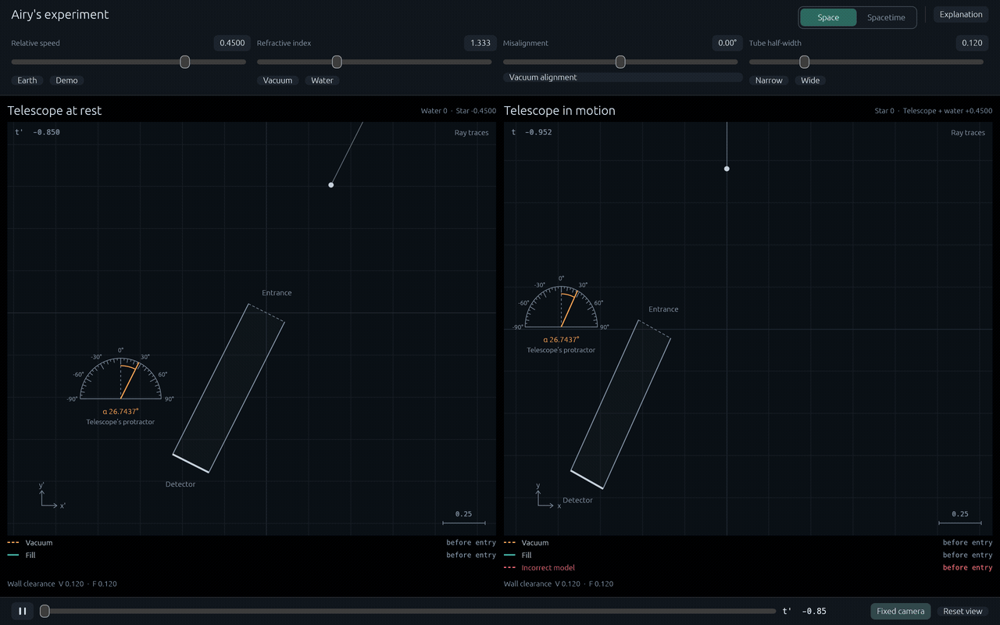
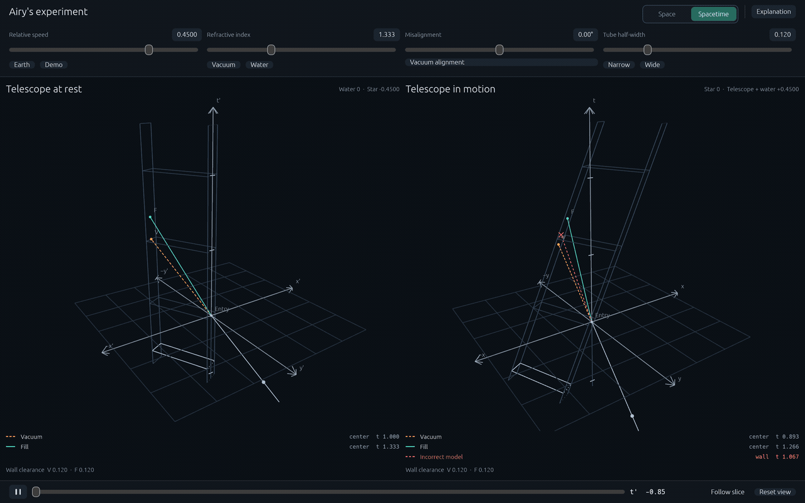

# Airy's experiment

Why doesn't water change a telescope's stellar aberration? Explore the same light paths with the telescope at rest or in motion, in a Rust + Bevy simulation. Includes a sourced explanation and relativistic proof.

**[Open the simulation](https://chemineer1.github.io/airys-experiment/)** · Requires WebGL 2.

**Space — watch the telescope move through incoming light.**



**Spacetime — see the light paths and telescope together through time.**



## Run in your browser

Install [Rust](https://www.rust-lang.org/tools/install) and Python 3. The repository pins its Rust toolchain. Run these commands in Bash:

```sh
git clone https://github.com/chemineer1/airys-experiment.git
cd airys-experiment
rustup target add wasm32-unknown-unknown
cargo install wasm-bindgen-cli --version 0.2.128 --locked
bash scripts/build-web.sh
python3 -m http.server 8000 --bind 127.0.0.1 --directory dist
```

Open [localhost:8000](http://localhost:8000). The first build takes a while.

Switch **Space / Spacetime**, adjust the sliders, and pause or scrub playback. On narrow screens, use **At rest / In motion** to switch cases and **Controls** for the sliders. Drag to orbit in Spacetime; scroll to zoom. **Explanation** covers the claim, Airy and ether drag, the physics, and the proof.

## Native app

```sh
cargo run --locked
```

Linux builds also need the Wayland/X11 development libraries and a working graphics driver.

## Physics tests

```sh
cargo test --locked --no-default-features --lib
```

[Physics and assumptions](docs/PHYSICS.md) · [Explanation](docs/EXPLANATION.md)

## Deploy

Push to `master`: GitHub Actions scans for secrets and vulnerable dependencies, tests the physics, builds the app, and deploys to Pages. You can also run **Actions → Test and deploy → Run workflow**. For a fork, enable **Settings → Pages → Source: GitHub Actions**. No deployment secrets are needed.
